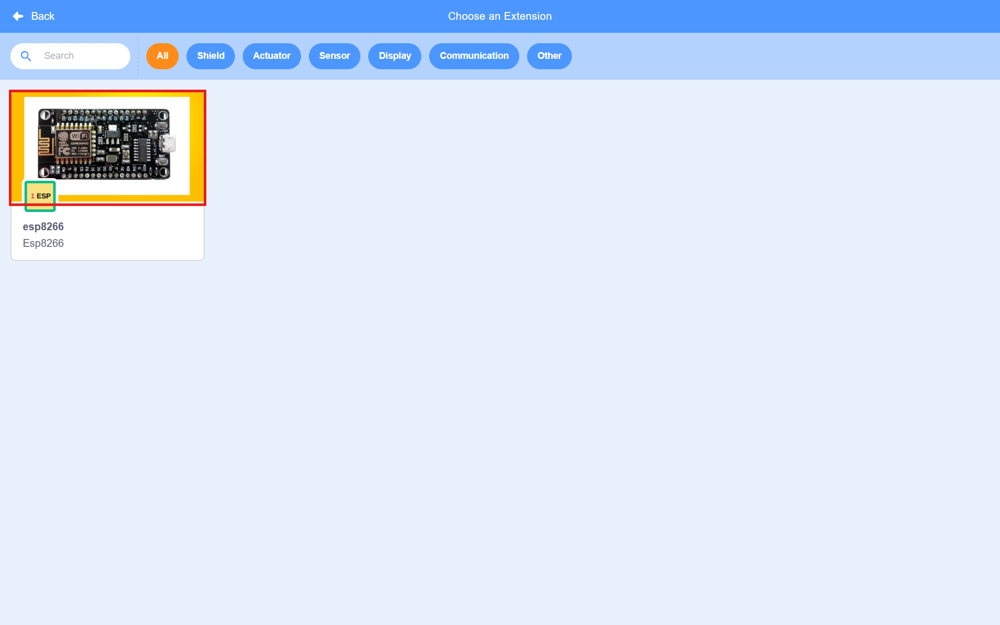

# BlockCoding

## 설치 목록

주의사항: nodejs와 python 버전은 맞춰주세요.

- nodejs: https://nodejs.org/en/blog/release/v16.20.2
- python: https://www.python.org/downloads/release/python-2718/
- Java: https://www.oracle.com/kr/java/technologies/downloads/#jdk21-windows
- 블록 코딩 웹 프론트: https://github.com/OttawaSTEM/scratch-arduino-gui.git
- 블록 코딩 앱: https://github.com/vision21tech/m042_nodeMcu_kotlinApp.git
    - sdk는 티라미슈 13 버전, build.gradle.kts(Module:app)에 아래 코드 추가
    
    ```jsx
    repositories {
        maven("https://jitpack.io")
    }
    ```
    
    - 의존성 수정: UsbSerial을 6.1.0 버전대신 6.0.6버전 사용.
    
    ```jsx
    //implementation("com.github.felHR85:UsbSerial:6.1.0")
    implementation("com.github.felHR85:UsbSerial:6.0.6")
    ```
    
    - gradle 8.9버전 사용
- 블록 코딩 아두이노 컴파일 서버: https://github.com/vision21tech/m042_nodeMcu_backEnd.git

## 블럭 확장 추가 과정

### 1. 추가할 확장 이미지 추가

- `scratch-arduino-gui\src\lib\libraries\extensions` 폴더에 “확장명”폴더를 추가한 후 그 폴더 안에 확장 이미지(확장 목록에 보여지는 이미지), 확장 아이콘을 추가
- 아래는 이미지 예시, 빨간 박스 안의 이미지가 확장 이미지이고, 초록 상자 안의 이미지가 확장 아이콘, 확장 아이콘은 이후 블록과 카테고리 표시에도 사용



- Ex) esp 확장을 추가하는 경우


위 이미지 처럼 esp 라는 폴더를 새로 생성한 후, 확장 이미지(onegpioEsp.png), 확장 아이콘(onegpioEsp-small.png)을 추가

### 2. 확장 목록에 추가할 확장 추가

- `scratch-arduino-gui\src\lib\libraries\extensions\index.jsx`  해당 파일에 추가할 확장의 설정을 아래 코드처럼 추가. 디바이스 id는 `scratch-arduino-gui\src\lib\libraries\devices\index.jsx` 에서 확인가능. 그리고 다른 확장들의 속성에 `supportDevice`가 없다면 빈 배열로 추가(ex: `supportDevice: []`)
- 설정을 추가하면서 이전 단계에서 추가한 확장 이미지와 아이콘을 설정
    
    ```jsx
    import 확장이름IconURL from './확장명/확장 이미지';             // 확장 이미지
    import 확장이름InsetIconURL from './확장명/확장 아이콘'; // 확장 아이콘
    
    ...
    
    {
            name: (
                <FormattedMessage
                    defaultMessage="확장명"
                    description="확장 이름 설명"
                    id="gui.extension.확장명.name"
                />
            ),
            extensionId: '확장명',
            iconURL: extensionconURL,
            insetIconURL: extensionInsetIconURL,
            description: (
                <FormattedMessage
                    defaultMessage="확장명"
                    description="확장 설명"
                    id="gui.extension.확장명.description"
                />
            ),
            featured: true,
            supportDevice: ['arduinoEsp8266']//지원하는 디바이스 목록, 디바이스 id를 작성
        }
    ```
    
- 디바이스 아이디 확인법
    
    `scratch-arduino-gui\src\lib\libraries\devices\index.jsx` 에서 각 객체의 deviceId 값 확인
    
    ```jsx
    ...
    {
            name: 'Arduino Uno',
            deviceId: 'arduinoUno',     // 디바이스 ID
            manufactor: 'arduino.cc',
            leanMore: 'https://store.arduino.cc/usa/arduino-uno-rev3',
            type: 'arduino',
            iconURL: arduinoUnoIconURL,
    ...
    ```
    
- Ex) esp 확장의 설정을 추가
    
    ```jsx
    ...
    import esp8266IconURL from './esp/onegpioEsp.png';
    import esp8266InsetIconURL from './esp/onegpioEsp-small.png';
    
    export default [
    	...
        {
          name: (
              <FormattedMessage
                  defaultMessage="esp8266"
                  description="Esp8266 Extention"
                  id="gui.extension.esp8266.name"
              />
          ),
          extensionId: 'esp8266',
          iconURL: esp8266IconURL,
          insetIconURL: esp8266InsetIconURL,
          description: (
              <FormattedMessage
                  defaultMessage="Esp8266"
                  description="Esp8266 Extention"
                  id="gui.extension.esp8266.description"
              />
          ),
          featured: true,
          supportDevice: ['arduinoEsp8266', 'arduinoUno']
      }
    ];
    
    ```
    

### 3. 리액트 코드 수정

- LibraryItem의 isUnloadble을 false로 수정
    
    ```jsx
    <LibraryItem
        ...
        isUnloadble={false}
        ...
    />
    ```
    
- LibraryItemComponent의 isUnloadble을 false로 수정
    
    ```jsx
    <LibraryItemComponent
        ...
        isUnloadble={false}
        ...
    />
    ```
    
- LibraryComponent의 autoClose를 true로 수정
    
    ```jsx
    <LibraryComponent
        autoClose={true}
        ...
    />
    ```
    
- 아래 파일에 `componentDidMount()` , `updateDeviceExtensions()` 함수 추가, `handleItemSelect(item)` 수정
    
    ```jsx
    // 추가한 코드
    componentDidMount() {
        if (this.props.isRealtimeMode === false) {
            this.updateDeviceExtensions();
        }
    }
    
    updateDeviceExtensions() {
        this.setState({deviceExtensions: extensionLibraryContent});
    }
    //
    
    handleItemSelect(item) {
            const id = item.extensionId;
    
            // 수정한 코드
            let url = item.extensionURL ? item.extensionURL : id;
            if (!item.disabled && !id) {
                // eslint-disable-next-line no-alert
                url = prompt(this.props.intl.formatMessage(messages.extensionUrl));
            }
            if (id && !item.disabled) {
                if (this.props.vm.extensionManager.isExtensionLoaded(url)) {
                    this.props.onCategorySelected(id);
                } else {
                    this.props.vm.extensionManager.loadExtensionURL(url).then(() => {
                        this.props.onCategorySelected(id);
                        analytics.event({
                            category: 'extensions',
                            action: 'select extension',
                            label: id
                        });
                    });
                }
            }
            //
    }
    ```
    

### 4. node_modules의 패키지 수정(scratch-arduino-vm)

- `scratch-arduino-gui\node_modules\scratch-arduino-vm\src\extensions` 해당 경로에 “확장명”으로 폴더를 만든 후 폴더 안에 index.js 작성.(확장에 사용되는 블럭을 여기서 정의)
`index.js` 작성법은 다른 extension 혹은 모듈 제작자의 문서(https://github.com/scratchfoundation/scratch-vm/blob/develop/docs/extensions.md )를 확인.
- `index.js` 작성하면서 블록의 타입을 적어줘야 하는데, 블록의 타입은 `scratch-arduino-gui\node_modules\scratch-arduino-vm\src\extension-support\block-type.js` 여기서 확인. 각 블록이 무엇인지는 토글의 링크를 참고.
    - 링크
        - [https://ahnbk.com/?p=421](https://ahnbk.com/?p=421)
        - https://en.scratch-wiki.info/wiki/blocks
        - [https://medium.com/@hiroyuki.osaki/scratch-3-block-types-you-can-develop-and-samples-191b0d769b91](https://medium.com/@hiroyuki.osaki/scratch-3-block-types-you-can-develop-and-samples-191b0d769b91)
    
    ### 주의사항: 블록의 opcode에 print를 적으면 에러 발생
    
- Ex) esp 확장 추가 예시 (https://github.com/MrYsLab/s3onegpio 이 깃 허브의 코드 참고)
    
    ```jsx
    const ArgumentType = require('scratch-arduino-vm/src/extension-support/argument-type');
    const BlockType = require('scratch-arduino-vm/src/extension-support/block-type');
    const formatMessage = require('format-message');
    
    require('sweetalert');
    ...
    let the_locale = null;
    ...
    // common, 블록에 출력할 문자들을 정의
    const FormDigitalWrite = {
        'pt-br': 'Escrever Pino Digital [PIN]como[ON_OFF]',
        'pt': 'Escrever Pino Digital[PIN]como[ON_OFF]',
        'en': 'Write Digital Pin [PIN] [ON_OFF]',
        'fr': 'Mettre la pin numérique[PIN]à[ON_OFF]',
        'zh-tw': '腳位[PIN]數位輸出[ON_OFF]',
        'zh-cn': '引脚[PIN]数字输出[ON_OFF]',
        'pl': 'Ustaw cyfrowy Pin [PIN] na [ON_OFF]',
        'de': 'Setze digitalen Pin [PIN] [ON_OFF]',
        'ja': 'デジタル・ピン [PIN] に [ON_OFF] を出力',
        'nl': 'Schrijf Digitale Pin [PIN] [ON_OFF]',
    };
    
    const FormSetNeopixel = {
        'pt-br': '',
        'pt': '',
        'en': '네오픽셀 세팅([COUNT]개의 LED를 [PIN]에 연결)',
        // 'en': 'Set Neopixel (Connect [COUNT] LED To [PIN] PIN)',
        'fr': '',
        'zh-tw': '',
        'zh-cn': '',
        'pl': '',
        'de': '',
        'ja': '',
        'nl': '',
    }
    ...
    
    // 본격적인 확장 정의의
    class Scratch3EspOneGPIO {
        constructor(runtime) {
            the_locale = this._setLocale();
            this.runtime = runtime;
        }
    
        getInfo() {
            the_locale = this._setLocale();
            // this.connect();
            // swal(FormAlrt[the_locale]);
    
            return {
                id: 'esp8266',      // 확장 id
                color1: '#0C5986',  // 블록 생상
                color2: '#34B0F7',  // 블록 안의 드롭다운 메뉴 색상
                name: 'esp8266',    // 카테고리 항목에 출력할 이름
                // 블록 아이콘 이미지
                blockIconURI: 'data:image/png;base64,iVBORw0KGgoAAAANSUhEUgAAAXoAAAF5CAYAAACRNOE+AAAABHNCSVQICAgIfAhkiAAAABl0RVh0U29mdHdhcmUAZ25vbWUtc2NyZWVuc2hvdO8Dvz4AABoeSURBVHic7d15fNT1ncfx92+O3CHkABJAjnAKcsutcnkVr9YLqfWoVtSlHvVYaWuru63dVlu31VrwqEcVDzwW8SgV5D5EQVDumxAChCQEEnLPzG//WLfbdiuaySQz88nr+acPk3yZ329e8/t95/v7/Zz6ggddAQDM8kR7AACA5kXoAcA4Qg8AxhF6ADCO0AOAcYQeAIwj9ABgHKEHAOMIPQAYR+gBwDhCDwDGEXoAMI7QA4BxhB4AjCP0AGAcoQcA4wg9ABhH6AHAOEIPAMYRegAwjtADgHGEHgCMI/QAYByhBwDjCD0AGEfoAcA4Qg8AxhF6ADCO0AOAcYQeAIwj9ABgHKEHAOMIPQAYR+gBwDhCDwDGEXoAMI7QA4BxhB4AjCP0AGAcoQcA4wg9ABhH6AHAOEIPAMYRegAwjtADgHGEHgCMI/QAYByhBwDjCD0AGEfoAcA4Qg8AxhF6ADCO0AOAcYQeAIwj9ABgHKEHAOMIPQAYR+gBwDhCDwDGEXoAMI7QA4BxhB4AjCP0AGAcoQcA4wg9ABhH6AHAOEIPAMYRegAwjtADgHGEHgCMI/QAYByhBwDjCD0AGEfoAcA4Qg8AxhF6ADCO0AOAcYQeAIwj9ABgHKEHAOMIPQAYR+gBwDhCDwDGEXoAMI7QA4BxhB4AjCP0AGAcoQcA4wg9ABhH6AHAOEIPAMYRegAwjtADgHGEHgCMI/QAYByhBwDjCD0AGEfoAcA4Qg8AxhF6ADCO0AOAcYQeAIwj9ABgHKEHAOMIPQAYR+gBwDhCDwDGEXoAMI7QA4BxhB4AjCP0AGAcoQcA4wg9ABhH6AHAOEIPAMYRegAwjtADgHGEHgCMI/QAYByhBwDjCD0AGEfoAcA4Qg8AxhF6ADCO0AOAcYQeAIwj9ABgHKEHAOMIPQAYR+gBwDhCDwDGEXoAMI7QA4BxhB4AjCP0AGAcoQcA4wg9ABhH6AHAOEIPAMYRegAwjtADgHGEHgCMI/QAYByhBwDjCD0AGOeL9gAAfB2uao+f0KEjJ1RcVq3y43WqrK5XTV1Q9YGQgq7k8Xrk9/uUnJSgtPREZWQkKyc7TbkdUpWZyDFda0bowxEIqvbDGtWVuXIb8WNOdqLSz02Qx2m2kUWFe/yw3lt4WEdD0R5JM/C21fhLuqmLtwX/ZkO1dm4s1EefHtS6zYe1eWeZduwrV/GJoEKN2eG+4DhepWa3UfduOerbu70G9u+o4cNO0cg+bZTaQv13y4v0+jtFKg1j/JHgOI68Pq8Sk/xKS01S28wUdWjfRp3y0pSZaOwN+U849QUPRumlj0+hPdU69nilKneF1KjKS3L6pCvvkTT5jR1cBbYu1ogLl2pTINojaQaJ/fXqpit0aULz/plgZZmWzd+sN+dv0/urD6uoKtTY3auRHCVmZWvUmX10yQX9ddmEjsprxn9jrO4jjtev7I7Z6ndqroYM6qyxI7rrrKHZyjJ2CGzsn9OM6oOqmXNcR9+sU6Ah2oOBDSGVb9uup/74kZ5+d78Kqxt3htg0ruqOlmrp26Va+vYqzcjO1UVTR+muGwZoeLaxI5GTcIMNKi08rGWFh7Xsgw36nRz50jM1ZlJ/Tbl0kK48I0cZLXk210xazxZtgtC2KpXeVaIjrxJ5REbtgV16+LYn1XfyHP1kToH2t2jk/5Gr+rJDevP3c3XmWTN11RO7daDV7ueuApVHtWzuck2/7gn1OHu27nllvw7F+etB6E+mNqDqZ8p0cEaFqvYxw4UICNXo4xfe1MhzZ+v+ecUqD8bSfuUqdKJEbz0yWyOumK+39sXYPEtLc11V7Nmpx2Y8p9POm6NfLTuu+miPKUyE/ksEPz+hkttLVTK3XsFWvr8jMtyqw3py+lM6+4GN2loVS4H/B25IpevX6OrLX9Ej62ujeKYRK1xV7t6in143S+Pu36gdNdEeT+MR+n9U1aATT5Tq4P2Vqj7ILo7IcI/v18+ve0F3vF+u2rjYrVwFS3brJ9e+ooc3xutxbGS5oRqte/EtnTl1gRaUxMVG/CtC/1euAp9U6sj3y1T25waFLC4VRHTUFeuxW1/VQ5/UKN52q1DFfv3btHmacyi+wtZ8XJWvX6XLp76nd4vjZ2sSekmqaFDlo6U69O8nVBNnn9SIcW6tFv/yDf14VXXcRf5/uAoc3Kw7f7he+4LRHkuscFWzc52uvXGxVlZGeyxfTysPvauGFRUqnl6qo4sCYV2MApxMxerFmv6nUtXH9b7lqnTpQt09tzJOP6yag6sTm1bqmh9v0aE4eFFa7Tp692i9Kmcd17HVAblx/SZEzAoc0RP/sU67A03dwRwlZudo9JjuGjsoV6f1yla3Tm2Ul5WsjDS/Ev1eeUIB1dU16NixKhUXlWvX7iPasGG/Fi/bp08P1anJi3tC1Xr/t8u15PzJmpjaxN9lhRvSgXfe111nn6LZF6fH9FFz6wu966r+wwqV/bFa9XFy2oX4VLFstWZtCoS/asXxqfPIIbrr1hG6+ox2yjzZu9XjU7LPp+TUZOV1ytHgEb10+dSxkluvfWs2aebMFXpq6VE1ZbFPsHCDHp13hsZPbRPTUWtRoROa+8slWjjxIp2bFu3BfLnWF/rqWh37Q7Xqw11I4Djy9/YquIOpnqbzqN9tN2ntPXn2dkS3Wu+/tlWHwzytd1Jz9d2HLtOvv9VOTeqHk6Buo4bqV6MG6Ob5i3T9jI+0pjzMi7PcBi1+cb22XDlOp7XY1aJN30eCDQHVVNeqrKxShQVl2rK5SKtW79YHa0pU2tD0N3Hw4Of6xStjNOmmbMXqRbR8MDeCk5uotj9tp9xbk+TllcNJuJV7NHdlXVhBdZJydccz12lmUyP/d/zKP/88zX9tsiZ38Ci823i5ati+Sa9vjYNJ6b/h9fuUlpGmrvl5OmPCaZr2/fP0/Ox/UcGaaXr5rv7qn+6E+Xp8wW3QmhfXak0Mr0IlV1+Hz6ukSzOV9/ssZQz38qLhK9Vv2KtV4cyTOD4NvvWb+tmY5KbF50uk9BmuP80aq8FJYf72QJnenl8sC9cQ+rPzdPkdV+jjBVdrxqhUeZvwggcLN2v2mti9TwLNOhlH8vZNUfajOepwQ5L8SdEeEOJDSAWbD6ssjANfJ62X7rw2V4mRH9RfpQ8dp1m35Cq8u/OGtHPFXhUYWmrpz+upf3v+Wj18Zmr4QQyd0J8/OKC6SA4sggj9l0n1K/XmbOU9nKG0fF4mNIarvXvL1fgWOkoc2kuTMpthSH/Hp8E3jtcV7cI7hA1sL9BH1hYyJHfQ9397oabmhfteD+nwmr3aGqOnOua+A2syx5F/TJqybkpVUo79BxKgGbj1Ki6pD2PNuaP2+dnKbIHdzmnTU9O+maVXnio7yQeSI29iknI7ZSq/a6byu2Ypv2umenRrr5HNfH/+aHCy++rnd+Rr3g93qTKMWbfg3iKtOyYNzon82JqK0P8Np0Oi2tycoYwR3maZH0Ur4darsjq81RwpKf4W2ve8GvaNPur2x49UlJamrl2y1KNrprp/EfP8rpnq0SVL3XKTldRqTmgddbp4uC55ZLdeKmv89nODZdqyJyjlxN7aG0Iv/c+XrRemK+vqZPmToz0YxD83zHsluaqorGuxq0/9gydo9YaJatPGxxzu/0rtpgtGJ2j2u2GsmAqd0N6iBikGF1m27u3rSJ7eKcr+TY46fI/II0Icr5ISwjkud1W6/Yha7F5ZHr/aEvl/kKDBg9rLH86Puq5KS2Lznkatdxun+pR6U7Y6PpKhtB6t92VAM3AS1TbMtdkNG7Zo7gGuxIseR3mnZCisz2m5qqhouTOyxmh9hXMc+Uenq8MTOcq5OEHe2DvLQtzzKjc3vKV6bl2hHv3NVhXT+qjxpSYqNcwvShoaYnPdaesLfUqSMu9NY0UNmpFXvXplhfkFWEhF897R1McLdYzYR0cT0uD1xWZSY3NUQJzLOa2juoa71CFUoxWPvqjxd6/T+oqIDgtfQ7CqTuEtmnKUnOSLyRV7hB5oBr5Te2hCuya8vdx6bXnzXZ0x8Y+a/vwe7auO3NhwMq6OFFWqLszQZ2enxGRUY3FMQPxLOEWXndOmiQvtXDWUFOrpB15Uv1G/1wX3LdFzS4pVHKvX2ZsQ0KYtJeHdy8eToM4dk2LyiJ519ECz8Gns1EHq9/IybWzyg0dcBY6XasGrS7Tg1aXypqRr4Ih8TTqju8aP7qbRp2YonUUFkVFfpIWra8NbOePJUp+usXnsTOiBZuI/dbjuPfsTXT8/kmurXQWrK7R+yQatX7JBv5YjX3qGBg7torGnn6JRQztr5KAO6pIem8GJdRXLP9NbYT4b0JOTp6GdY/N1J/SIqmNbt+ul14tjag7RScjUhIu6qsnvWSdNl993lp5e/hctb8qjnU7KVaDymD5dekyfLv1cj0tyvH51yO+oEUM7a9SwUzR62Cka1iNV4d6ZuNUIHNGTj28K82ExjtKGdNWQGC1qjA4LrUNIBxcu0bSF0R7H33PSB+mtb3RV5wjcuMuXP1wz79uhMx/co/IWupLGDTbo8M4CzdtZoHmvSXIcJWVl6/Th3TRuTHeNH9tNo3qmNuutkONPgzY8+Y5+uaEhvKdvOX6NndhNGTH6YUrogWblVe9rLtWz25/XVS+Xhrmao4lcV7VlpVoxv1Qr5q/VQ45HaXm5Gjeulyaf3UcXntFRea36WQsN2v7af+myRw+EdddKSXJS83XlpLSY/CJWYtUN0Pw8abrg37+jF65sp5RYKIEb0omDB/XeK0s1/canlT/sd5r0g0V6fnW5TrSyi7TcqhLNefAFjZ+xVYVhf2nuKPf8IbowO6JDiyhCD7QEX1td+svv6r37eqmzPxZq/79cBU+Ua/lbyzRt6uPqcd6ruv/NIhXH6AM0IqX2SJHenDlPEyY8qWueO6CyUPifcI6/vW68oacyIji+SGPqBmgpnhSNvfXb+mTUWt33o0WavbVGwVg6gnZDKt++TQ/fvV2znuirO354ju4+J0spUR5Wxa49mvt+eRMe8xdUbU29jpZWaP++En3+2QGt2V6pqibE/f84yr1gvKb3i+31rYQeaFGOsocM1zPv9NO0N5frwcfX6cPCML8AbC6uq4rdW/Wzm3brtckT9PTPR2l0VrTOQkI68OcF+vafo/Tnv4KnbU898K99lR1LJ2n/BFM3QDT4UjViyvl6f/EdWv7bcZoyOD32lj+69drx3gc69+I5mrWlPrY+jGKBJ1Xn/3CyrusUaxvu/yP0QDT50zTiWxP04tt3as/8b+t3tw7UuPxkxc40vqu6wq26c+rLeuQz7r3wV45X+ZdfpFlXZsbg86T+P0IPxASvcvr21q0zLtWCxfeocNH1mv3Ambp+YkedkuqJ+rK90LECPXDjW3puXyw+VqOFOR61P/Mcvf6zvsqNk4IyRw/EHK+y8rvpivxuuuKGSVKgRrs+K9DS1fu09KMCrfi0WEVVoRaeSnEVLNmhu+9coSGvnaXBrfVqK8ejvHHnaO4fRmlAHF17QOiBWOdLVs9hfdVzWF/d+H1JgVrt23JAazYc1NrPivTJhiJt2FOl6oisIjkZVyc2LNftz52qD29pF95zVeOZJ1EDp16sOQ/2V34ErppuSYQeUeRRv9tu0tp78tgRG8OXpG4De6rbwJ6a8sV/aqgo12efFmrV2v1a+XGBVm4oVUmdG/mjfrdBH8/8UHMuu0pXt4v0L49VjrxZnTTtwUv0i0vaKTXawwkD7y/AAH+bTJ0+PlOnjx+o2yW5tZXa+PEeLVi6U+8v3KXVBbVq8t2SvxA6vlO/e6VYU27vYD4gji9Vwy8fp4fvPV1jcuJkQv6fsL6dgFbJSUrXwLMGaeBZg3T3TwI69PkOvTT7Y82aW6DC2iYW3w1q4xsb9Mmt52m0yfkbR56UDI29aITuunmYvtEjMe5XrRB6wDyf8gb2070D++n2O/Zq1iPz9dDcIzrWhDn94IHtmrvxbI0eGg+LC78OR57kNA0Y1UsXn99fUyZ3V+828Z73/0PogVYksWN33fGfN+ni8xbo2/d8rHXh3q4xeFwr1pQrODQnLtaRS44cryO/z6eUtCRlZqYqLy9DXbtkqU+fXA0a0EmjBmQr2+QZCqEHWiGfup//Dc3vkKJLrlmiVWHFPqQt6w/phHKa+WZefGEfCXbOTQA0SsaQs/TSA73VLqwKuKovPKoDwUiPCs2B0AOtlqPO35qgW/qEl4Fg8XEd4ELZuEDogdbM116XnNsurGkRt7pOVYQ+LjDtBbSwumPHtGNnibbuLNHW3VXqOXWSru4ZrWMuj3r1a6dkp7jRj9FzQwHV1Ek8fDb2EXqgWbiqOfpF0Hcc0ZadJdqys0Rbd5Zqb2n931y85NWgjEG66vb2UVu94k1LUpqjMJ6X6sjDnEBcIPRAJATK9eGrm7V4+xFt2VGiLTtLVXC04Ws8QSqozW9v1IZ/maRhUXo3ujUNqg5j4Y3j8ys1zu750loReiAiarTkuUV6eFfjJ60De9br9x+O0bPnJUfhdsSuDhaUqyaM0Huy0hTHdwVoVdhMQCT42mvimLTwpl9CVXrjP1drbW2kB/U1uNVatvKwGsL4UW+nTHWhIHGBzQREhE8jz+6l9mGuSa/btlrTHyvUiUgP6ysEdq/X0yvCeWatR+37tFcHChIX2ExAhKSMOk3fzAvzLeU26LMn39D3Xi9TfWSH9eUayvTUgyu1tj6cCXq/hp+e2/ruSR+nCD0QKYlddcPl7cJ+3qsbOK7/mvEnTXm6SOXN/QyRhnK98aNXNGNFjcJZCu8kddH5o+PoEUutHKEHIsajAVNH6uy08L9SdQPH9d5Dz2n49Ys0d1ddMzwu0NWxbRt191XP6NrXSxXeHYsdpY3trwtyIj02NBdW3SCqjm3drpdeL479Iw5vG429KF89vmKuwpM3UD++5iMtnHlEDeFW2g1o/5JlmrJirQacPUQ3XTVQ3zqjg9o3ZZ4kUK2tq7bp5Vc/0bN/OaySpjyFxJOuy79zqtpH+4nl+NpaXeiDG6tVvaeJj1grbVAojPNdt7xBVfOq5AnzDeKk+pUyKUFeM2+wkA4uXKJpC6M9jq8hoZeemZivHm2/6n/0afgt5+jad17Rs4VNe4C3G6jW5/NX6rb5q3RnahsNHNZFIwfmamDvbHXvnKGO2SnKzEhUSoJXCT4pGAipvrZelZU1Kiut1IGiY9q584g+33hAq9YdVkFlMAJnCI5ShozS3WdxOWw8aXWhb1h5QkffjdIt947U6vgzTVhD1yFVCeMT5G11Wy2+OBm99POfDdGi732qvRF5fp+rYNVxrV+2UeuXbYzA7wuf42+n6fcPV+/4uAk9vhDzZ8xAPMoef66euzlXKWbOviQ5fg265WL9aChrbeINoQeag5OoMXdN0cyL2oa9CiemOB7lTjxfs+/srNRojwWNRuiB5uJrq6m/+Y7+MLmtEuI69o5yRk3UW48PUy+mDeMSoQeaU0KOrnvsu3r1hk5qG4/vNsen7pMv0AfPnqHTOZSPW/G46wHxxZehC396vVY+NkIjsjxRuHFZeJykLF38o2u18onTdVpKtEeDpiD0QIvwq9dFk7XkL9fp15flKiuW18g6PnUeO0YvvnOzXp/WhTtUGsAmBFqQr31X3fboNG1591L9eHKusn0xFHzHr84jh+mRF6Zr08vn6sreiXFz9oGT46sVoMV5lNVvgB6YOUD3FhXozTnr9dK8bVq+t1YRWXbfGI6jpJxcnXPBAF0zZZAu6JfKjcoMIvRAFKV06qprftBV1/wgoJLt+7Vg6W4t+qhAKz89rL3HAgpFPPyOfKnp6jfoFI0d2V0Tz+qpiYPbKr2Zz+097brr5tsdHWn0FeWO2o1MY+qhiZz6ggdb+hgCwFdxgyovKtGmbUe0bc9R7S48rsLDFTpcUqWS8lodr6xTVU2DauqCCnwRT4/XI3+CT8nJCUpLS1Jm2xS1a5emvNw26to5Uz3yc9S3V3v165amFMrZqhB6ADCOz3UAMI7QA4BxhB4AjCP0AGAcoQcA4wg9ABhH6AHAOEIPAMYRegAwjtADgHGEHgCMI/QAYByhBwDjCD0AGEfoAcA4Qg8AxhF6ADCO0AOAcYQeAIwj9ABgHKEHAOMIPQAYR+gBwDhCDwDGEXoAMI7QA4BxhB4AjCP0AGAcoQcA4wg9ABhH6AHAOEIPAMYRegAwjtADgHGEHgCMI/QAYByhBwDjCD0AGEfoAcA4Qg8AxhF6ADCO0AOAcYQeAIwj9ABgHKEHAOMIPQAYR+gBwDhCDwDGEXoAMI7QA4BxhB4AjCP0AGAcoQcA4wg9ABhH6AHAOEIPAMYRegAwjtADgHGEHgCMI/QAYByhBwDjCD0AGEfoAcA4Qg8AxhF6ADCO0AOAcYQeAIwj9ABgHKEHAOMIPQAYR+gBwDhCDwDGEXoAMI7QA4BxhB4AjCP0AGAcoQcA4wg9ABhH6AHAOEIPAMYRegAwjtADgHGEHgCMI/QAYByhBwDjCD0AGEfoAcA4Qg8AxhF6ADCO0AOAcYQeAIwj9ABgHKEHAOMIPQAYR+gBwDhCDwDGEXoAMI7QA4BxhB4AjCP0AGAcoQcA4wg9ABhH6AHAOEIPAMYRegAwjtADgHGEHgCMI/QAYByhBwDjCD0AGEfoAcA4Qg8AxhF6ADCO0AOAcYQeAIwj9ABgHKEHAOMIPQAYR+gBwDhCDwDGEXoAMI7QA4BxhB4AjCP0AGAcoQcA4wg9ABhH6AHAOEIPAMYRegAwjtADgHGEHgCMI/QAYByhBwDjCD0AGEfoAcA4Qg8AxhF6ADCO0AOAcYQeAIwj9ABgHKEHAOMIPQAYR+gBwDhCDwDGEXoAMI7QA4BxhB4AjCP0AGAcoQcA4wg9ABhH6AHAOEIPAMYRegAwjtADgHGEHgCMI/QAYByhBwDj/hsKe8Y+togcowAAAABJRU5ErkJggg==',
                // 블록 정의
                blocks: [
                    {
                        // opcode: 블록 아이디, 블록의 동작을 정의할 때 키로 사용됨.
                        // blackType: 블록 타입, 해당 블록의 종류를 설정.
                        // text: 블록에 출력할 문자를 설정
                        // arguments: 블록의 인자들을 설정.
                        // arguments-name: 인자의 이름을 지정(여기서는 IP_ADDR), 블록의 동작을 정의할 때 값을 불러오기 위해 사용
                        // argumnets-name-type: 인자의 타입을 설정, 숫자, 문자, 불리안이 있음.
                        // argumnets-name-defaultValue: 인자의 기본값을 설정
                        // argumnets-name-menu: 드롭다운을 적용할 인자일 경우 menu에 값 배열의 키를 할당
                        opcode: 'ip_address',
                        blockType: BlockType.COMMAND,
                        //text: 'Write Digital Pin [PIN] [ON_OFF]',
                        text: FormIPBlockE[the_locale],
    
                        arguments: {
                            IP_ADDR: {
                                type: ArgumentType.NUMBER,
                                defaultValue: '',
                            },
    
                        }
                    },
                    {
                        opcode: 'digital_write',
                        blockType: BlockType.COMMAND,
                        text: FormDigitalWrite[the_locale],
    
                        arguments: {
                            PIN: {
                                type: ArgumentType.NUMBER,
                                defaultValue: '4',
                                menu: "digital_pins"
                            },
                            ON_OFF: {
                                type: ArgumentType.NUMBER,
                                defaultValue: '0',
                                menu: "on_off"
                            }
                        }
                    },
                    ...
                ],
                // 드롭다운 메뉴에 사용할 값들을 설정
                // acceptReporters: 드롭다운 메뉴를 갖고있는 블록의 인자에 Reporter블록 허용 여부
                menus: {
                    digital_pins: {
                        acceptReporters: true,
                        items: ['4', '5', '12', '13', '14', '15']
                    },
                    pwm_pins: {
                        acceptReporters: true,
                        items: ['4', '5', '12', '13', '14', '15']
                    },
    
                    mode: {
                        acceptReporters: true,
                        items: [{text: "Input", value: '1'}, {text: "Output", value: '2'}]
                    },
                    on_off: {
                        acceptReporters: true,
                        items: ['0', '1']
                    },
                    buadrate: {
                        items: [{text: "4800", value: '4800'}, {text: "9600", value: '9600'}, {text: "19200", value: '19200'}, {text: "38400", value: '38400'},
                            {text: "57600", value: '57600'}, {text: "76800", value: '76800'}, {text: "115200", value: '115200'}]
                    },
                    line_break: {
                        items: [{text: "true", value: 'true'}, {text: "false", value: 'false'}]
                    }
                }
            };
        }
    
        // The block handlers
    
        // command blocks
        ...
        _setLocale () {
            let now_locale = '';
            switch (formatMessage.setup().locale){
            case 'pt-br':
            case 'pt':
                now_locale='pt-br';
                break;
            case 'en':
                now_locale='en';
                break;
            case 'fr':
                now_locale='fr';
                break;
            case 'zh-tw':
                now_locale= 'zh-tw';
                break;
            case 'zh-cn':
                now_locale= 'zh-cn';
                break;
            case 'pl':
                now_locale= 'pl';
                break;
            case 'ja':
                now_locale= 'ja';
                break;
            case 'de':
                now_locale= 'de';
                break;
            case 'nl':
                now_locale= 'nl';
                break;
            default:
                now_locale='en';
                break;
            }
            return now_locale;
        }
        ...
    }
    
    module.exports = Scratch3EspOneGPIO;
    ```
    
- index.js 작성 후에는 아래 파일에 밑줄 친 부분처럼 작성한 확장을 추가
    
    ```jsx
    const builtinExtensions = {
        // This is an example that isn't loaded with the other core blocks,
        // but serves as a reference for loading core blocks as extensions.
        coreExample: () => require('../blocks/scratch3_core_example'),
        // These are the non-core built-in extensions.
        pen: () => require('../extensions/scratch3_pen'),
        music: () => require('../extensions/scratch3_music'),
        text2speech: () => require('../extensions/scratch3_text2speech'),
        translate: () => require('../extensions/scratch3_translate'),
        videoSensing: () => require('../extensions/scratch3_video_sensing'),
        확장명: () => require('../extensions/확장폴더이름'),
        //예시 esp: () => require('../extensions/esp')
    };
    ```
    
- 아래 파일 코드 수정, 이 코드를 수정해야 디바이스 선택 후 확장을 골랐을 때 확장 블록들이 제대로 보여짐.
    
    ```jsx
    getBlocksXML (target) {
        const _loadedDeviceExtensionsXML = [];
        this._loadedDeviceExtensions.forEach((value, id) => {
    
            _loadedDeviceExtensionsXML.push({id: id, xml: value.xml});
        });
    
        if (this.getCurrentDevice() === null) {
            return this.generateXMLfromBlockInfo(target, this._blockInfo);
        } else if (this.getCurrentIsRealtimeMode()) {
            return this.generateXMLfromBlockInfo(target, this._deviceBlockInfo.concat(this._blockInfo));
        }
        //수정전 코드
        //return this.generateXMLfromBlockInfo(target, this._deviceBlockInfo).concat(_loadedDeviceExtensionsXML);
        //수정 후 코드
        return this.generateXMLfromBlockInfo(target, this._deviceBlockInfo.concat(this._blockInfo)).concat(_loadedDeviceExtensionsXML);
    
    }
    ```
    

### 5. node_modules의 패키지 수정(scratch-arduino-blocks)

- scratch-arduino-blocks 패키지를 수정한 후에는 npm run prepublish를 실행해야 수정 내용이 반연됨
- 블록 추가 및 빌드에 필요한 패키지 다운로드.

```bash
npm install
npm link
```

- 블록에 대응하는 코드 추가. code에 해당하는 부분이 화면에 보여지게됨. 작성법은 다른 블럭을 참고

```jsx
Blockly.Arduino['arduino_esp8266_digital_write'] = function (block) {
    var arg0 = block.getFieldValue('PIN') || '0';
    var arg1 = block.getFieldValue('ON_OFF') || 'LOW';
    var code = "digitalWrite(" + arg0 + ", " + arg1 + ");\n";
    return code;
};
```

- 블럭 작성이 완료된 후에는 내용을 적용하기 위해 다시 빌드함. 블럭 내용이 수정될 때마다 아래 명령어를 실행.

```bash
npm run prepublish
```

- `Blockly.Arduino.valueToCode()` 를 사용하는 블럭에서 `Cannot read properties of undefined (reading 'call')`에러가 발생한다면, 아래 코드에서 `targetBlock` 의 type 속성을 확인하고 type명에 해당하는 함수를 math.js 혹은 text.js에 작성해야함.
    
    ```jsx
    Blockly.Generator.prototype.valueToCode = function(block, name, outerOrder) {
      if (isNaN(outerOrder)) {
        goog.asserts.fail('Expecting valid order from block "%s".', block.type);
      }
      var targetBlock = block.getInputTargetBlock(name);
      //
      console.log("targetBlock", targetBlock);
      //
      if (!targetBlock) {
        return '';
      }
      ...
    };
    ```
    
    - 예를 들어서 아래와 같은 블럭이 있다고 있다고 해보자
    
    ```jsx
    Blockly.Arduino['arduino_esp8266_digital_write'] = function (block) {
        var pinBlock = block.getInputTargetBlock('PIN');
        var arg0 = pinBlock ? Blockly.Arduino.valueToCode(block, 'PIN', Blockly.Arduino.ORDER_UNARY_POSTFIX) || pinBlock.getFieldValue('digital_pins') || '0' : '0';
        
        var onOffBlock = block.getInputTargetBlock('ON_OFF');
        var arg1 = onOffBlock ? Blockly.Arduino.valueToCode(block, 'ON_OFF', Blockly.Arduino.ORDER_UNARY_POSTFIX) || (onOffBlock.getFieldValue('on_off') === '1' ? 'HIGH' : 'LOW') || 'LOW' : 'LOW';
    
        var code = "digitalWrite(" + arg0 + ", " + arg1 + ");\n";
        return code;
    };
    ```
    
    - 위 블럭의 `targetBlock` 값을 보면 `arduino_esp8266_menu_digital_pins`  임을 확인할 수 있다. 따라서 이를 키로 `math.js`에 아래처럼 코드를 추가해 주면 된다. 이 과정을 거쳐야 블록에 지정한 숫자를 읽을 수 있다. 만약 숫자가 아닌 문자를 읽어야 되는 상황에서 `Cannot read properties of undefined (reading 'call')`  이 에러가 발생한다면, `text.js` 에 코드를 추가해주면 된다.
    
    ```jsx
    Blockly.Arduino['arduino_esp8266_menu_digital_pins'] = Blockly.Arduino['math_number'];
    ```
    
    - 만약 블록의 인자가 드롭다운 메뉴의 값도 받고, Reporter블록의 값도 받는다면, 함수를 아래처럼 조금 다르게 작성한다. 이렇게 작성하면 두 가지 방식의 값을 모두 받을 수 있다.
    
    ```jsx
    Blockly.Arduino['arduino_esp8266_menu_digital_pins'] = function(block) {
      var code = parseFloat(block.getFieldValue('NUM'));
      if (isNaN(code)) {
        code = null; // 원래 0이었던 값을 null로 교체
      }
      var order = code < 0 ?
        Blockly.Arduino.ORDER_UNARY_PREFIX : Blockly.Arduino.ORDER_ATOMIC;
      return [code, order];
    };
    ```
    

## 한글화

### 기존 블럭 한글화

기존 블럭들의 한글화는 
`scratch-arduino-gui\node_modules\scratch-arduino-blocks\msg\scratch_msgs.js` 
위 파일의 `Blockly.ScratchMsgs.locales["en"]` 객체를 수정.

Ex) if 블럭 수정

```jsx
Blockly.ScratchMsgs.locales["en"] =
{
    "CONTROL_FOREVER": "forever",
    "CONTROL_REPEAT": "repeat %1",
    "CONTROL_IF": "if %1 then",
```

위 코드에서 `CONTROL_IF` 가 if 블럭의 키이므로

```jsx
Blockly.ScratchMsgs.locales["en"] =
{
    "CONTROL_FOREVER": "forever",
    "CONTROL_REPEAT": "repeat %1",
    "CONTROL_IF": "만약 %1 이라면",
```

이렇게 수정, 여기서 %1은 블럭의 인자로 인자는 아래의 사진처럼 다른 블럭이 들어갈 수 있는 칸, 직접 값을 입력할 수 있는 칸, 값 선택 필드리스트 등을 의미


수정하고자 하는 블럭의 키를 확인하기 위해선 2가지 방법을 사용할 수 있음.

- `scratch-arduino-gui\node_modules\scratch-arduino-blocks\blocks_vertical` 의 각 파일에서 블럭의 문구 출력에 사용하는 키를 확인
    
    if 블럭의 경우 위 경로의 control.js에 정의되어 있으며 코드는 아래와 같음
    
    ```jsx
    Blockly.Blocks['control_if'] = {
      /**
       * Block for if-then.
       * @this Blockly.Block
       */
      init: function() {
        this.jsonInit({
          "type": "control_if",
          "message0": Blockly.Msg.CONTROL_IF,
          "message1": "%1", // Statement
          "args0": [
            {
              "type": "input_value",
              "name": "CONDITION",
              "check": "Boolean"
            }
          ],
          "args1": [
            {
              "type": "input_statement",
              "name": "SUBSTACK"
            }
          ],
          "category": Blockly.Categories.control,
          "extensions": ["colours_control", "shape_statement"]
        });
      }
    };
    ```
    
    여기서 `message0`를 보면 `Blockly.Msg.CONTROL_IF` 가 할당되어 있는 걸 확인할 수 있음. 참고로 `Blockly.Msg`  가 실제로 출력에 사용되는 것은 아니고 `Blockly.ScratchMsgs`  가 실제로 사용됨. 위 방식은 그냥 키를 확인해 보기 위해 `Blockly.Msg` 의 값을 확인.(`Blockly.Msg` 와 `Blockly.ScratchMsgs` 가 동일한 키를 사용한다는 전제가 깔려있음.)
    
- `scratch-arduino-gui\node_modules\scratch-arduino-blocks\generators\arduino\` 위 폴더에 정의된 블럭들의 이름을 참고해서 유추
    
    위 경로의 `control.js` 의 코드의 `control_wait` 블럭의 출력 정의를 보면 아래와 같음
    
    ```jsx
    Blockly.Arduino['control_wait'] = function(block) {
      var arg0 = Blockly.Arduino.valueToCode(block, 'DURATION',
          Blockly.Arduino.ORDER_UNARY_POSTFIX);
      var code = "delay(" + arg0 + " * 1000" + ");\n";
      return code;
    };
    ```
    
    보통 `"CONTROL_WAIT": "wait %1 seconds"` 이런식으로 `control_wait`를 그대로 대문자로 옮겨서 키로 사용함.
    

### 확장 블럭(사용자 확장 블럭) 한글화

확장 블럭의 한글화는 아래 폴더의
`scratch-arduino-gui\node_modules\scratch-arduino-vm\src\extensions\`  확장이 정의된 코드에서 진행.

Ex) scratch3_esp 확장의 set_neopixel 블럭 한글화

 `scratch-arduino-gui\node_modules\scratch-arduino-vm\src\extensions\scratch3_esp\index.js` 를 확인해 보면

```jsx
...
const FormSetNeopixel = {
    'pt-br': '',
    'pt': '',
    'en': 'Set Neopixel (Connect [COUNT] LED To [PIN] PIN)',
    'fr': '',
    'zh-tw': '',
    'zh-cn': '',
    'pl': '',
    'de': '',
    'ja': '',
    'nl': '',
}
...            
                {
                    opcode: 'set_neopixel',
                    blockType: BlockType.COMMAND,
                    text: FormSetNeopixel[the_locale],

                    arguments: {
                        COUNT: {
                            type: ArgumentType.NUMBER,
                            defaultValue: '0'
                        },
                        PIN: {
                            type: ArgumentType.NUMBER,
                            menu: 'digital_pins',
                            defaultValue: '4'
                        }
                    }
                },
...
```

위와 같이 정의되어 있음. 블럭 정의 부분의 text가 블럭 출력시 사용할 문구를 할당하는 곳이고 FormSetNeopixel에 정의되어 있음. 따라서 이 값을 수정하면 한글화 가능. 여기서 [COUNT] 와 [PIN]은 블럭에 정의된 인자를 의미.

### 블럭 카테고리 한글화

- 기존 블럭 카테고리는 `scratch-arduino-gui\node_modules\scratch-arduino-blocks\msg\scratch_msgs.js` 의 `CATEGORY`로 시작하는 키를 수정
    
    Ex) Event 카테고리 한글화
    
    `"CATEGORY_EVENTS": “Events” → "CATEGORY_EVENTS": "이벤트”`  로 수정. 그럼 아래와 같이 출력됨.
    
    
    
- 확장 블럭 카테고리는 `scratch-arduino-gui\node_modules\scratch-arduino-vm\src\extensions\`  폴더의 확장 파일을 수정
    
    Ex) scratch3_esp 확장 카테고리 한글화
    
    ```jsx
    ...
    class Scratch3EspOneGPIO {
        constructor(runtime) {
            the_locale = this._setLocale();
            this.runtime = runtime;
        }
    
        getInfo() {
            the_locale = this._setLocale();
            // this.connect();
            // swal(FormAlrt[the_locale]);
    
            return {
                id: 'esp8266',
                color1: '#0C5986',
                color2: '#34B0F7',
                name: 'esp8266',
    ...
    ```
    
     `scratch-arduino-gui\node_modules\scratch-arduino-vm\src\extensions\scratch3_esp\index.js`  파일의 getInfo 함수의 리턴값에서 name을 수정 `name: 'esp8266', -> name: '한글 확장',` 
    
    
    

### 나머지 UI 한글화

- 나머지 UI는 `scratch-arduino-blocks` , `scratch-arduino-vm`  모듈이 아닌 메인 프로젝트에서 찾아보기.
- 메인 프로젝트에서 찾지 못한 한글화는 `scratch-arduino-gui\node_modules\scratch-arduino-blocks\msg\scratch_msgs.js` 에서 찾아보기

## 컴파일 라이브러리 추가

- 아두이노에서 특정 라이브러리를 추가해서 컴파일하고 싶다면, 
https://github.com/vision21tech/m042_nodeMcu_backEnd.git 해당 프로젝트의 arduino-cli를 이용해서 라이브러리를 추가해 주면 됩니다.
- 라이브러리 검색 명령어

```bash
arduino-cli lib search <라이브러리 이름>
```

- 라이브러리 추가 명령어

```bash
arduino-cli lib install <라이브러리 이름>
```

- arduino-cli의 다른 명령어가 궁금하다면 공식 문서(https://arduino.github.io/arduino-cli/0.35/)를 참고해 주세요.

## 웹 페이지 UI 수정

- 웹 페이지 전체 layout은 `scratch-arduino-gui\src\components\gui\gui.jsx` 위 파일에서 확인 가능
- 좌측 상단 로고 이미지 수정

```jsx
import scratchLogo from './scratch-logo.svg';//이거 수정

MenuBar.defaultProps = {
    logo: scratchLogo,
    onShare: () => {}
};
```

## 기타

- 파일 다운로드는 `scratch-arduino-gui\src\lib\download-blob.js`  해당 파일 참고

## TODO

- 핀 선택은 핀 리스트가 아니라 입력형식으로 만들기.
- 네오 픽셀 모두 키기, 각각 키기 블럭 추가
- 메뉴바에 불필요한 UI 제거(튜토리얼, remix, 스크린샷)
    
    
    
- 프로젝트 이름을 적어서 저장하면 반영되게
- 디바이스 연결 UI 제대로 동작하게 수정
    
    
    
- 프로젝트 저장이 동작하게 수정. 파일 저장 방식은 M042와 정한 후 적용
- 프로젝트 저장시 프로젝트 이름이 반영되게 수정
- 불필요한 탭 제거
    - 이미지(빨간 탭 제거)
        
        
        
- 툴을 누르면 Sign in이 같이 클릭되는 문제 수정
    - 이미지(빨간 박스가 툴 아이콘)
        
        
        
- Upload 버튼 클릭 후 나타나는 창에서 Upload Success 지우기
- Serial 모니터 동작하게 수정
    - 시리얼 모니터 이미지
        
        
        
- Upload 버튼 클릭 후 진행 로그 출력해주기. 진행 로그는 코틀린 앱에서 디버깅을 위해 만든 로그가 있는데 이걸 사용할 수 있으면 좋음.(실제 아두이노 업로드 로그처럼 만듬)
- 현재 esp확장에 기능이 너무 많이 들어가 있는데 기능 별로 분리하기.(네오픽셀, 블루투스)
- 컴파일러 앱 내장이 가능한지(컴파일러는 컴퓨터에서 동작 중)
- 디바이스 확장에서 필요없는 것들 제거하기
    - 이미지(빨간 박스 제거)
        
        
        
- 디바이스 변경을 하려면 워크스페이스(블록이 놓이는 공간)를 비우고 변경해야함. 이렇게 하지말고, 블록이 있어도 디바이스 변경이 가능하되, 변경 시 블록이 사라지게 수정
- 블록 추가 리스트는 나중에 제공
- 파일 저장
- 그 외에 필요없는 기능이나 UI는 M042와 상의후 결정
- 추가할 블록은 M042 패드에 설치된 어플을 통해서 확인할 수 있습니다.
- 앱을 사용할 때, 지금은 컴파일 서버와 웹 페이지 서버 주소만 맞춰주면 됩니다.
- scratch-arduino-vm.zip, scratch-arduino-block.zip 을 해제한 후 node_modules에 사하고 실행하시면됩니다.
